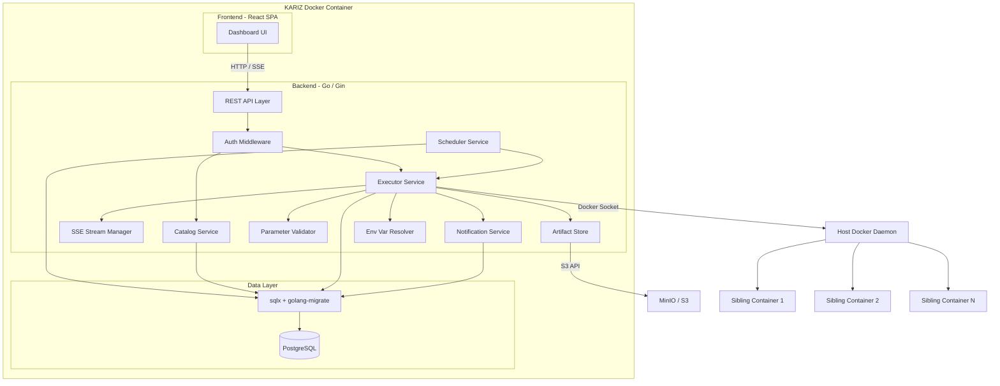
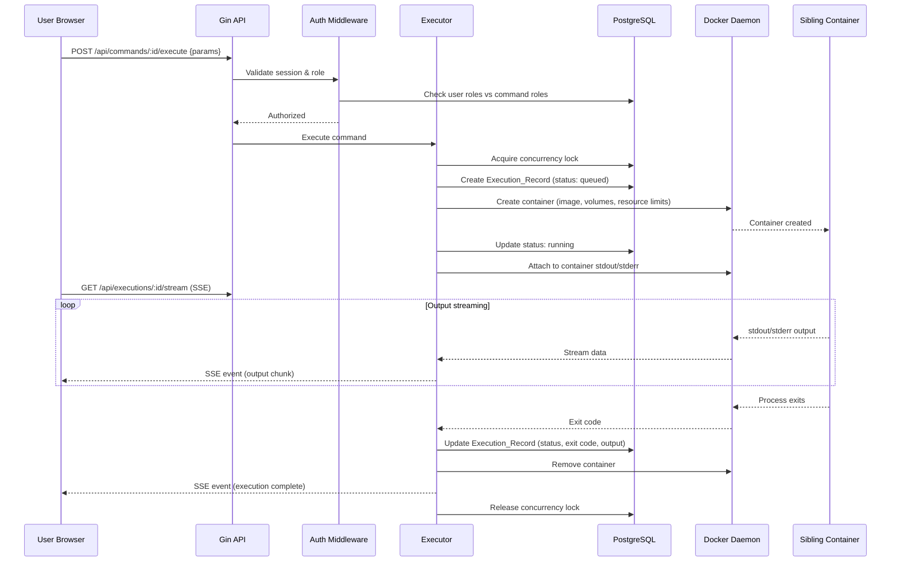
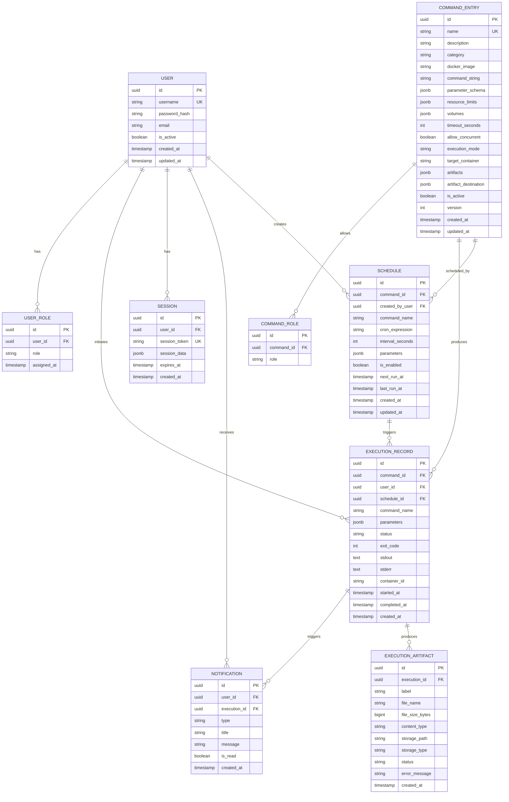

# Design Document: KARIZ Command Dashboard

## Overview

KARIZ is a self-service command execution platform that provides a web-based dashboard for QA, Data, and Operations teams to run pre-approved production commands on sibling Docker containers. The system follows a Docker-out-of-Docker pattern, communicating with the host Docker daemon through a mounted socket to create, execute, and clean up ephemeral containers.

The platform consists of three core subsystems:
1. **Dashboard** — A React SPA for browsing commands, executing them with parameters, and monitoring output in real time.
2. **Executor** — A Go backend service that manages Docker container lifecycle, enforces concurrency and timeout policies, and streams output.
3. **Command Catalog** — A registry of approved commands with metadata, parameter schemas, and role-based access rules.

All three subsystems are packaged into a single Docker image for deployment simplicity.

### Technology Decisions

| Area | Choice | Rationale |
|---|---|---|
| Backend | **Go with Gin** | Compiled to a single binary for minimal container image. Goroutines provide native concurrency for parallel command executions and output streaming. Docker is written in Go, so the Docker client library is the canonical, most up-to-date SDK. |
| Frontend | **React + TypeScript** | Richest ecosystem for admin dashboards. Libraries like `react-jsonschema-form` directly address dynamic Parameter_Schema form generation. Largest selection of component libraries (Ant Design, Material UI). |
| Database | **PostgreSQL** | JSONB support for flexible parameter schemas. Row-level locking handles concurrent execution record writes. Robust full-text search for command catalog filtering. |
| Auth | **Session-based (with OAuth2/OIDC extension point)** | Immediate session revocation satisfies Req 5.5. Permission changes take effect on next request (Req 5.4). Server-side sessions stored in PostgreSQL (or Redis for scale). |
| Docker SDK | **github.com/docker/docker/client** | Canonical Go Docker client. Full API coverage for container create, exec, log streaming, resource limits, volume mounts, and cleanup. |
| Real-time | **Server-Sent Events (SSE)** | Built-in browser reconnection via `EventSource`. `Last-Event-ID` header enables resume from last received position (Req 9.3). Unidirectional server-to-client fits the output streaming use case. Standard HTTP — no proxy issues. |
| ORM/DB Access | **sqlx** | Lightweight SQL toolkit for Go. No heavy ORM overhead. Direct SQL with struct scanning. Supports migrations via `golang-migrate`. |
| Frontend State | **TanStack Query + React Context** | TanStack Query for server state (caching, refetching). React Context for auth/session state. EventSource API for SSE consumption. |
| Cron Scheduling | **robfig/cron v3** | Mature Go cron library with standard 5-field and optional seconds support. Thread-safe, supports dynamic add/remove of entries. Provides next-run-time calculation for dashboard display. |
| Object Storage | **minio/minio-go v7** | S3-compatible Go SDK that works with both MinIO and AWS S3. Supports streaming uploads, presigned download URLs, and bucket management. Single SDK covers both artifact storage backends. |

---

## Architecture

The system follows a monolithic architecture packaged as a single Docker container, with clear internal module boundaries that allow future decomposition if needed.



### Key Architectural Decisions

1. **Single Container Deployment**: The Go binary serves the React SPA as static files and exposes the REST/SSE API. PostgreSQL runs as a sidecar process within the container (or connects to an external instance via environment variable). This satisfies Requirement 7.

2. **Docker-out-of-Docker**: The KARIZ container mounts the host's `/var/run/docker.sock`. Sibling containers are created on the host, not nested inside KARIZ. The Docker socket is never mounted into sibling containers (Req 6.3).

3. **SSE for Output Streaming**: Command output flows: sibling container → Executor (via Docker attach stream) → SSE endpoint → browser. Each active execution has a dedicated SSE channel identified by execution ID.

4. **Session-based Auth with Provider Interface**: An `AuthProvider` interface allows swapping in OAuth2/OIDC or LDAP backends without changing session management. Sessions are stored in PostgreSQL with an httpOnly secure cookie on the client.

5. **Concurrency Control**: The Executor uses a database-backed lock (advisory lock or row-level lock on execution records) to enforce single-execution-per-command unless `allow_concurrent` is true. Goroutines handle parallel execution naturally.

6. **Safe Parameter Substitution**: Parameters are injected into command strings via indexed argument passing (not string interpolation) to prevent shell injection. The command is split into an argument array before being passed to the Docker exec API.

7. **Dual Execution Mode**: Commands support two execution modes — "create" (ephemeral container lifecycle) and "exec" (Docker exec into a running container). The DockerManager abstracts both paths behind a unified interface. The Executor selects the path based on the command's `ExecutionMode` field.

8. **Environment Variable Resolution**: Parameters with `EnvVarMapping` are resolved at execution time by inspecting the target container's environment via the Docker API. User-provided values always take precedence over mapped values.

9. **Artifact Storage Abstraction**: An `ArtifactStore` interface abstracts local filesystem and S3-compatible object storage. Artifacts are copied from containers before cleanup and stored at the configured destination. Download is served via presigned URLs (S3/MinIO) or direct file serving (local).

10. **Cron-based Scheduling**: A background `SchedulerService` goroutine evaluates active schedules every minute using `robfig/cron`. Triggered executions are created with a reference to the originating schedule and the schedule creator's user ID.

### Request Flow: Command Execution



---

## Components and Interfaces

### 1. Auth Module

**Responsibility**: Authentication, session management, and role-based access control.

```go
// AuthProvider allows swapping auth backends (local DB, OAuth2, LDAP)
type AuthProvider interface {
    Authenticate(ctx context.Context, creds LoginCredentials) (*AuthResult, error)
    GetUserRoles(ctx context.Context, userID string) ([]Role, error)
}

type LoginCredentials struct {
    Username string `json:"username" binding:"required"`
    Password string `json:"password" binding:"required"`
}

type AuthResult struct {
    Success   bool         `json:"success"`
    User      *UserProfile `json:"user,omitempty"`
    SessionID string       `json:"session_id,omitempty"`
    Error     string       `json:"error,omitempty"`
}

type SessionData struct {
    UserID    string    `json:"user_id"`
    Username  string    `json:"username"`
    Roles     []Role    `json:"roles"`
    CreatedAt time.Time `json:"created_at"`
    ExpiresAt time.Time `json:"expires_at"`
}

type Role string

const (
    RoleAdmin      Role = "admin"
    RoleQA         Role = "qa"
    RoleData       Role = "data"
    RoleOperations Role = "operations"
)

// SessionStore manages server-side sessions in PostgreSQL
type SessionStore interface {
    Create(ctx context.Context, data SessionData) (sessionToken string, err error)
    Get(ctx context.Context, sessionToken string) (*SessionData, error)
    Delete(ctx context.Context, sessionToken string) error
    DeleteByUserID(ctx context.Context, userID string) error
    CleanExpired(ctx context.Context) error
}
```

### 2. Catalog Service

**Responsibility**: CRUD operations on Command_Entries, validation, and versioning.

```go
type CatalogService interface {
    CreateCommand(ctx context.Context, input CreateCommandInput) (*CommandEntry, error)
    UpdateCommand(ctx context.Context, id string, input UpdateCommandInput) (*CommandEntry, error)
    DeactivateCommand(ctx context.Context, id string) error
    GetCommand(ctx context.Context, id string) (*CommandEntry, error)
    ListCommands(ctx context.Context, filter CommandFilter) (*PaginatedResult, error)
    SearchCommands(ctx context.Context, query string, userRoles []Role) ([]CommandEntry, error)
}

type CommandEntry struct {
    ID                  string              `json:"id" db:"id"`
    Name                string              `json:"name" db:"name"`
    Description         string              `json:"description" db:"description"`
    Category            string              `json:"category" db:"category"`
    DockerImage         string              `json:"docker_image" db:"docker_image"`
    CommandString       string              `json:"command_string" db:"command_string"`
    ParameterSchema     ParameterSchema     `json:"parameter_schema" db:"parameter_schema"`
    AllowedRoles        []Role              `json:"allowed_roles"`
    ResourceLimits      ResourceLimits      `json:"resource_limits" db:"resource_limits"`
    Volumes             []VolumeMount       `json:"volumes" db:"volumes"`
    TimeoutSeconds      int                 `json:"timeout_seconds" db:"timeout_seconds"`
    AllowConcurrent     bool                `json:"allow_concurrent" db:"allow_concurrent"`
    ExecutionMode       ExecutionMode       `json:"execution_mode" db:"execution_mode"`
    TargetContainer     string              `json:"target_container,omitempty" db:"target_container"`
    Artifacts           []ArtifactDeclare   `json:"artifacts,omitempty" db:"artifacts"`
    ArtifactDestination *ArtifactDestConfig `json:"artifact_destination,omitempty" db:"artifact_destination"`
    IsActive            bool                `json:"is_active" db:"is_active"`
    Version             int                 `json:"version" db:"version"`
    CreatedAt           time.Time           `json:"created_at" db:"created_at"`
    UpdatedAt           time.Time           `json:"updated_at" db:"updated_at"`
}

type ExecutionMode string

const (
    ModeCreate ExecutionMode = "create"
    ModeExec   ExecutionMode = "exec"
)

type ArtifactDeclare struct {
    ContainerPath string `json:"container_path"` // Path inside the container where the file is produced
    Label         string `json:"label"`          // Human-readable label for the artifact
}

type ArtifactDestConfig struct {
    Type           ArtifactDestType `json:"type"`                      // "local", "minio", "s3"
    Bucket         string           `json:"bucket,omitempty"`          // Bucket name for MinIO/S3
    PathPrefix     string           `json:"path_prefix,omitempty"`     // Path prefix within bucket or local dir
    Endpoint       string           `json:"endpoint,omitempty"`        // MinIO/S3 endpoint URL
    CredentialRef  string           `json:"credential_ref,omitempty"`  // Reference to stored credentials (env var name)
    Region         string           `json:"region,omitempty"`          // AWS region for S3
}

type ArtifactDestType string

const (
    DestLocal ArtifactDestType = "local"
    DestMinIO ArtifactDestType = "minio"
    DestS3    ArtifactDestType = "s3"
)

type ParameterSchema struct {
    Parameters []ParameterDefinition `json:"parameters"`
}

type ParameterDefinition struct {
    Name         string            `json:"name"`
    Type         ParameterType     `json:"type"`          // string, number, boolean, enum
    Required     bool              `json:"required"`
    DefaultValue interface{}       `json:"default_value,omitempty"`
    Description  string            `json:"description"`
    Validation   *ValidationRules  `json:"validation,omitempty"`
    EnvVarMapping *EnvVarMapping   `json:"env_var_mapping,omitempty"` // Optional mapping to a sibling container's env var
}

// EnvVarMapping binds a parameter to an environment variable from a running sibling container.
// At execution time, the Executor reads the env var from the source container and injects it as the parameter value.
// If the user provides an explicit value for the parameter, the mapping is ignored.
type EnvVarMapping struct {
    SourceContainer string `json:"source_container"` // Name or ID of the running container
    EnvVarName      string `json:"env_var_name"`     // Environment variable name to read
}

type ParameterType string

const (
    ParamString  ParameterType = "string"
    ParamNumber  ParameterType = "number"
    ParamBoolean ParameterType = "boolean"
    ParamEnum    ParameterType = "enum"
)

type ValidationRules struct {
    Pattern    string   `json:"pattern,omitempty"`
    Min        *float64 `json:"min,omitempty"`
    Max        *float64 `json:"max,omitempty"`
    EnumValues []string `json:"enum_values,omitempty"`
    MaxLength  *int     `json:"max_length,omitempty"`
}

type ResourceLimits struct {
    CPUShares *int64 `json:"cpu_shares,omitempty"`
    MemoryMB  *int64 `json:"memory_mb,omitempty"`
    CPUCount  *int64 `json:"cpu_count,omitempty"`
}

type VolumeMount struct {
    HostPath      string `json:"host_path"`
    ContainerPath string `json:"container_path"`
    ReadOnly      bool   `json:"read_only"`
}

type CommandFilter struct {
    Category string `json:"category,omitempty"`
    IsActive *bool  `json:"is_active,omitempty"`
    Roles    []Role `json:"roles,omitempty"`
    Page     int    `json:"page"`
    PageSize int    `json:"page_size"`
}
```

### 3. Executor Service

**Responsibility**: Docker container lifecycle, command execution, output streaming, concurrency control, and timeout enforcement.

```go
type ExecutorService interface {
    ExecuteCommand(ctx context.Context, commandEntry CommandEntry, params map[string]interface{}, userID string) (*ExecutionRecord, error)
    CancelExecution(ctx context.Context, executionID string) error
    GetExecutionStream(ctx context.Context, executionID string) (<-chan OutputChunk, error)
    GetExecutionStatus(ctx context.Context, executionID string) (*ExecutionRecord, error)
}

type ExecutionRecord struct {
    ID          string              `json:"id" db:"id"`
    CommandID   string              `json:"command_id" db:"command_id"`
    CommandName string              `json:"command_name" db:"command_name"`
    UserID      string              `json:"user_id" db:"user_id"`
    Parameters  json.RawMessage     `json:"parameters" db:"parameters"`
    Status      ExecutionStatus     `json:"status" db:"status"`
    ExitCode    *int                `json:"exit_code" db:"exit_code"`
    Stdout      string              `json:"stdout" db:"stdout"`
    Stderr      string              `json:"stderr" db:"stderr"`
    ContainerID *string             `json:"container_id" db:"container_id"`
    ScheduleID  *string             `json:"schedule_id,omitempty" db:"schedule_id"`
    Artifacts   []ExecutionArtifact `json:"artifacts,omitempty"`
    StartedAt   *time.Time          `json:"started_at" db:"started_at"`
    CompletedAt *time.Time          `json:"completed_at" db:"completed_at"`
    CreatedAt   time.Time           `json:"created_at" db:"created_at"`
}

// ExecutionArtifact represents a file artifact produced by a command execution.
type ExecutionArtifact struct {
    ID            string    `json:"id" db:"id"`
    ExecutionID   string    `json:"execution_id" db:"execution_id"`
    Label         string    `json:"label" db:"label"`
    FileName      string    `json:"file_name" db:"file_name"`
    FileSizeBytes int64     `json:"file_size_bytes" db:"file_size_bytes"`
    ContentType   string    `json:"content_type" db:"content_type"`
    StoragePath   string    `json:"storage_path" db:"storage_path"` // Path in storage backend
    StorageType   string    `json:"storage_type" db:"storage_type"` // "local", "minio", "s3"
    Status        string    `json:"status" db:"status"`             // "stored", "failed"
    ErrorMessage  string    `json:"error_message,omitempty" db:"error_message"`
    CreatedAt     time.Time `json:"created_at" db:"created_at"`
}

type ExecutionStatus string

const (
    StatusQueued    ExecutionStatus = "queued"
    StatusRunning   ExecutionStatus = "running"
    StatusCompleted ExecutionStatus = "completed"
    StatusFailed    ExecutionStatus = "failed"
    StatusTimedOut  ExecutionStatus = "timed_out"
    StatusCancelled ExecutionStatus = "cancelled"
)

type OutputChunk struct {
    Stream    string    `json:"stream"`    // "stdout" or "stderr"
    Data      string    `json:"data"`
    Timestamp time.Time `json:"timestamp"`
}

// DockerManager abstracts Docker daemon communication
type DockerManager interface {
    // Container lifecycle (create mode)
    CreateContainer(ctx context.Context, config ContainerConfig) (containerID string, err error)
    StartContainer(ctx context.Context, containerID string) error
    AttachStream(ctx context.Context, containerID string) (<-chan OutputChunk, error)
    StopContainer(ctx context.Context, containerID string, timeout int) error
    RemoveContainer(ctx context.Context, containerID string) error
    IsAvailable(ctx context.Context) error

    // Exec mode — run command inside an already-running container
    ExecInContainer(ctx context.Context, containerID string, command []string) (execID string, err error)
    AttachExecStream(ctx context.Context, execID string) (<-chan OutputChunk, error)
    InspectExec(ctx context.Context, execID string) (*ExecInspectResult, error)

    // Environment variable inspection
    InspectContainerEnv(ctx context.Context, containerNameOrID string) (map[string]string, error)

    // File copy from container
    CopyFromContainer(ctx context.Context, containerID string, srcPath string) (io.ReadCloser, error)
}

type ExecInspectResult struct {
    ExitCode int  `json:"exit_code"`
    Running  bool `json:"running"`
}

type ContainerConfig struct {
    Image          string            `json:"image"`
    Command        []string          `json:"command"`
    Volumes        []VolumeMount     `json:"volumes"`
    ResourceLimits ResourceLimits    `json:"resource_limits"`
    Environment    map[string]string `json:"environment,omitempty"`
}
```

### 4. Stream Manager

**Responsibility**: Manages SSE connections for real-time output delivery.

```go
type StreamManager interface {
    // Subscribe returns a channel of SSE events for an execution.
    // If lastEventID is provided, replays events from that point.
    Subscribe(executionID string, lastEventID string) (<-chan SSEEvent, func())

    // Publish sends an output chunk to all subscribers of an execution.
    Publish(executionID string, chunk OutputChunk)

    // Complete signals execution completion to all subscribers.
    Complete(executionID string, finalStatus ExecutionStatus)

    // Cleanup removes all state for an execution.
    Cleanup(executionID string)
}

type SSEEvent struct {
    ID    string `json:"id"`    // Sequential event ID for resume
    Event string `json:"event"` // "output", "status", "complete"
    Data  string `json:"data"`  // JSON payload
}
```

### 5. Notification Service

**Responsibility**: In-app and email notifications for execution completion.

```go
type NotificationService interface {
    NotifyExecutionComplete(ctx context.Context, execution ExecutionRecord) error
    GetNotifications(ctx context.Context, userID string, unreadOnly bool) ([]Notification, error)
    MarkAsRead(ctx context.Context, notificationID string) error
}

type Notification struct {
    ID          string           `json:"id" db:"id"`
    UserID      string           `json:"user_id" db:"user_id"`
    Type        NotificationType `json:"type" db:"type"`
    Title       string           `json:"title" db:"title"`
    Message     string           `json:"message" db:"message"`
    ExecutionID string           `json:"execution_id" db:"execution_id"`
    IsRead      bool             `json:"is_read" db:"is_read"`
    CreatedAt   time.Time        `json:"created_at" db:"created_at"`
}

type NotificationType string

const (
    NotifyComplete NotificationType = "execution_complete"
    NotifyFailed   NotificationType = "execution_failed"
    NotifyTimedOut NotificationType = "execution_timed_out"
)
```

### 6. Parameter Validator

**Responsibility**: Validates user-provided parameters against a command's Parameter_Schema and performs safe substitution into command strings.

```go
type ParameterValidator interface {
    Validate(schema ParameterSchema, params map[string]interface{}) *ValidationResult
    BuildCommandArgs(commandString string, schema ParameterSchema, validatedParams map[string]interface{}) ([]string, error)
}

type ValidationResult struct {
    Valid  bool              `json:"valid"`
    Errors []ValidationError `json:"errors,omitempty"`
}

type ValidationError struct {
    ParameterName string `json:"parameter_name"`
    Message       string `json:"message"`
    Code          string `json:"code"` // "required", "invalid_type", "validation_failed", "unknown_parameter"
}
```

### 7. Environment Variable Resolver

**Responsibility**: Resolves parameter values from environment variables of running sibling containers at execution time.

```go
type EnvVarResolver interface {
    // ResolveParams takes a parameter schema and user-provided params, resolves any
    // EnvVarMappings by reading env vars from running containers, and returns the
    // fully resolved parameter map. User-provided values take precedence over mappings.
    ResolveParams(ctx context.Context, schema ParameterSchema, userParams map[string]interface{}) (map[string]interface{}, error)
}

// EnvVarResolutionError provides details when env var resolution fails.
type EnvVarResolutionError struct {
    ParameterName   string `json:"parameter_name"`
    SourceContainer string `json:"source_container"`
    EnvVarName      string `json:"env_var_name"`
    Reason          string `json:"reason"` // "container_not_found", "container_not_running", "env_var_not_found"
}
```

### 8. Artifact Store

**Responsibility**: Stores and retrieves file artifacts produced by command executions. Abstracts local filesystem and S3-compatible object storage behind a unified interface.

```go
type ArtifactStore interface {
    // Store saves an artifact from a reader to the configured storage backend.
    // Returns the storage path and file size.
    Store(ctx context.Context, executionID string, label string, fileName string, content io.Reader) (*StoredArtifact, error)

    // GetDownloadURL returns a URL or file path for downloading an artifact.
    // For S3/MinIO, returns a presigned URL. For local, returns a file-serve path.
    GetDownloadURL(ctx context.Context, storagePath string, storageType ArtifactDestType) (string, error)

    // Delete removes an artifact from storage.
    Delete(ctx context.Context, storagePath string, storageType ArtifactDestType) error
}

type StoredArtifact struct {
    StoragePath   string `json:"storage_path"`
    StorageType   string `json:"storage_type"`
    FileSizeBytes int64  `json:"file_size_bytes"`
    ContentType   string `json:"content_type"`
}

// LocalArtifactStore stores artifacts on the local filesystem within the KARIZ container.
// S3ArtifactStore stores artifacts in MinIO or AWS S3 using the minio-go SDK.
// The implementation is selected based on the command's ArtifactDestConfig.
```

### 9. Scheduler Service

**Responsibility**: Manages command schedules and triggers automatic executions based on cron expressions or fixed intervals.

```go
type SchedulerService interface {
    // CreateSchedule registers a new schedule for a command.
    CreateSchedule(ctx context.Context, input CreateScheduleInput) (*Schedule, error)

    // UpdateSchedule modifies an existing schedule.
    UpdateSchedule(ctx context.Context, id string, input UpdateScheduleInput) (*Schedule, error)

    // DeleteSchedule removes a schedule.
    DeleteSchedule(ctx context.Context, id string) error

    // EnableSchedule activates a schedule.
    EnableSchedule(ctx context.Context, id string) error

    // DisableSchedule deactivates a schedule without deleting it.
    DisableSchedule(ctx context.Context, id string) error

    // ListSchedules returns schedules visible to the user's roles.
    ListSchedules(ctx context.Context, filter ScheduleFilter) ([]Schedule, error)

    // GetSchedule returns a single schedule by ID.
    GetSchedule(ctx context.Context, id string) (*Schedule, error)

    // Start begins the background scheduler loop.
    Start(ctx context.Context) error

    // Stop gracefully shuts down the scheduler.
    Stop() error
}

type Schedule struct {
    ID             string          `json:"id" db:"id"`
    CommandID      string          `json:"command_id" db:"command_id"`
    CommandName    string          `json:"command_name" db:"command_name"`
    CreatedByUser  string          `json:"created_by_user" db:"created_by_user"`
    CronExpression string          `json:"cron_expression,omitempty" db:"cron_expression"`
    IntervalSec    *int            `json:"interval_seconds,omitempty" db:"interval_seconds"`
    Parameters     json.RawMessage `json:"parameters,omitempty" db:"parameters"`
    IsEnabled      bool            `json:"is_enabled" db:"is_enabled"`
    NextRunAt      *time.Time      `json:"next_run_at" db:"next_run_at"`
    LastRunAt      *time.Time      `json:"last_run_at" db:"last_run_at"`
    CreatedAt      time.Time       `json:"created_at" db:"created_at"`
    UpdatedAt      time.Time       `json:"updated_at" db:"updated_at"`
}

type CreateScheduleInput struct {
    CommandID      string          `json:"command_id" binding:"required"`
    CronExpression string          `json:"cron_expression,omitempty"`
    IntervalSec    *int            `json:"interval_seconds,omitempty"`
    Parameters     json.RawMessage `json:"parameters,omitempty"`
}

type UpdateScheduleInput struct {
    CronExpression *string          `json:"cron_expression,omitempty"`
    IntervalSec    *int             `json:"interval_seconds,omitempty"`
    Parameters     *json.RawMessage `json:"parameters,omitempty"`
}

type ScheduleFilter struct {
    CommandID string `json:"command_id,omitempty"`
    IsEnabled *bool  `json:"is_enabled,omitempty"`
    Roles     []Role `json:"roles,omitempty"`
    Page      int    `json:"page"`
    PageSize  int    `json:"page_size"`
}
```

### REST API Endpoints

| Method | Path | Description | Auth |
|---|---|---|---|
| POST | `/api/auth/login` | Authenticate user | Public |
| POST | `/api/auth/logout` | End session | Authenticated |
| GET | `/api/auth/me` | Get current user profile | Authenticated |
| GET | `/api/commands` | List commands (filtered by role) | Authenticated |
| GET | `/api/commands/:id` | Get command details | Authenticated |
| POST | `/api/commands` | Register new command | Admin |
| PUT | `/api/commands/:id` | Update command | Admin |
| DELETE | `/api/commands/:id` | Deactivate command | Admin |
| POST | `/api/commands/:id/execute` | Execute a command | Role-based |
| GET | `/api/executions` | List execution history | Authenticated |
| GET | `/api/executions/:id` | Get execution details | Authenticated |
| GET | `/api/executions/:id/stream` | SSE stream for execution output | Authenticated |
| POST | `/api/executions/:id/cancel` | Cancel running execution | Authenticated |
| GET | `/api/notifications` | Get user notifications | Authenticated |
| PUT | `/api/notifications/:id/read` | Mark notification as read | Authenticated |
| GET | `/api/health` | Health check endpoint | Public |
| GET | `/api/admin/users` | List users | Admin |
| PUT | `/api/admin/users/:id/roles` | Update user roles | Admin |
| GET | `/api/executions/:id/artifacts` | List artifacts for an execution | Authenticated |
| GET | `/api/executions/:id/artifacts/:artifactId/download` | Download an artifact file | Authenticated |
| GET | `/api/schedules` | List schedules (filtered by role) | Authenticated |
| GET | `/api/schedules/:id` | Get schedule details | Authenticated |
| POST | `/api/schedules` | Create a new schedule | Role-based |
| PUT | `/api/schedules/:id` | Update a schedule | Role-based |
| DELETE | `/api/schedules/:id` | Delete a schedule | Role-based |
| POST | `/api/schedules/:id/enable` | Enable a schedule | Role-based |
| POST | `/api/schedules/:id/disable` | Disable a schedule | Role-based |

---

## Data Models

### Entity Relationship Diagram



### Key Data Design Decisions

1. **JSONB for flexible schemas**: `parameter_schema`, `resource_limits`, and `volumes` are stored as JSONB columns. This allows flexible schema evolution without migrations for every parameter change.

2. **Denormalized command_name in Execution_Record**: The command name is copied into the execution record so historical records remain readable even if the command is later renamed or deleted.

3. **Separate stdout/stderr columns**: Stored as TEXT columns to allow independent retrieval. For very large outputs, a future optimization could stream to object storage and store a reference.

4. **Session table**: Server-side sessions stored in PostgreSQL. The session token is the only value sent to the client (in an httpOnly, Secure, SameSite=Strict cookie).

5. **Soft delete for commands**: The `is_active` flag implements soft delete. Deactivated commands remain in the database for historical execution record integrity.

6. **Version column**: Incremented on each update to a CommandEntry, providing an audit trail of changes.

7. **Execution mode and target container**: The `execution_mode` column defaults to `"create"`. When set to `"exec"`, the `target_container` column stores the name/ID of the running container. For `"create"` mode, `target_container` is null and `docker_image` is used instead.

8. **Artifact metadata in separate table**: `EXECUTION_ARTIFACT` is a child table of `EXECUTION_RECORD`. Each row tracks one file artifact with its storage location, size, and status. This allows partial success (some artifacts stored, others failed).

9. **Schedule table**: Stores cron expressions and interval definitions. `next_run_at` is pre-computed and indexed for efficient polling by the scheduler. `command_name` is denormalized for display without joins.

10. **Schedule-execution linkage**: `EXECUTION_RECORD.schedule_id` is a nullable FK to `SCHEDULE`. Manual executions have `schedule_id = NULL`. This allows filtering execution history by schedule.

---

## Correctness Properties

*A property is a characteristic or behavior that should hold true across all valid executions of a system — essentially, a formal statement about what the system should do. Properties serve as the bridge between human-readable specifications and machine-verifiable correctness guarantees.*

### Property 1: Command storage round-trip

*For any* valid `CreateCommandInput` with a unique name, non-empty command string, at least one role, and any valid `ParameterSchema`, creating the command and then retrieving it by ID should return a `CommandEntry` with identical values for all fields: name, description, category, docker image, command string, parameter schema (including all parameter definitions with types, constraints, and defaults), allowed roles, resource limits, volumes, timeout, and concurrency flag.

**Validates: Requirements 1.1, 8.1**

### Property 2: Duplicate name rejection

*For any* command name that already exists in the catalog, submitting a new command definition with that same name should be rejected with a duplicate-name error, and the catalog should remain unchanged (the original command is unmodified and no new command is created).

**Validates: Requirements 1.2**

### Property 3: Version increment on update

*For any* existing `CommandEntry` at version V, applying a valid update should result in the command having version V+1. For any sequence of N updates to the same command, the final version should equal the initial version plus N.

**Validates: Requirements 1.3**

### Property 4: Deactivation hides from non-admins

*For any* active `CommandEntry`, after deactivation, the command's `is_active` field should be false, and listing commands for any non-admin role set should not include that command. Listing commands for the admin role should still include it.

**Validates: Requirements 1.4**

### Property 5: Invalid command definition rejection

*For any* `CreateCommandInput` that has an empty name, an empty command string, or zero allowed roles, the catalog should reject the creation and return a validation error. The catalog should not contain a new entry.

**Validates: Requirements 1.5**

### Property 6: Role-based command filtering

*For any* user with a given set of roles and any catalog state, every command returned by `ListCommands` should satisfy two conditions: (a) `is_active` is true, and (b) the command's allowed roles have at least one role in common with the user's roles.

**Validates: Requirements 2.1**

### Property 7: Search filter correctness

*For any* search query string and any catalog of commands, every command returned by `SearchCommands` should contain the search query as a case-insensitive substring of either its name or its description.

**Validates: Requirements 2.3**

### Property 8: Parameter validation rejects invalid inputs

*For any* `ParameterSchema` and any parameter map that violates the schema (missing required parameters, wrong types, values outside constraints, or unknown parameters), `Validate` should return `valid=false` with at least one `ValidationError` that identifies the offending parameter by name.

**Validates: Requirements 3.2, 8.4**

### Property 9: Concurrency lock enforcement

*For any* `CommandEntry` with `allow_concurrent=false` that has an execution currently in `running` status, a new execution request for the same command should be rejected. For any `CommandEntry` with `allow_concurrent=true`, a new execution request should be accepted regardless of existing running executions.

**Validates: Requirements 3.6**

### Property 10: Execution history pagination and ordering

*For any* set of execution records and any pagination request with page P and page_size S, the returned records should be ordered by `created_at` descending, the count should not exceed S, and the records should correspond to the correct offset (P * S) into the full ordered set.

**Validates: Requirements 4.1**

### Property 11: Execution history filter correctness

*For any* combination of filter criteria (command name, user ID, date range, execution status) applied to a set of execution records, every returned record should satisfy all applied filter criteria simultaneously.

**Validates: Requirements 4.3**

### Property 12: Role-based execution denial

*For any* user role set and any `CommandEntry` allowed role set where the intersection is empty, attempting to execute the command should be rejected with an access denied error.

**Validates: Requirements 5.3**

### Property 13: Container config correctness

*For any* `CommandEntry` with any combination of volume mounts and resource limits, the generated `ContainerConfig` should contain exactly the declared volumes (and never include `/var/run/docker.sock` as a mount), and the CPU and memory limits should match the values specified in the command entry.

**Validates: Requirements 6.3, 6.5**

### Property 14: Shell injection prevention

*For any* command string template and any parameter values — including strings containing shell metacharacters (`;`, `|`, `$()`, `` ` ``, `&&`, `||`, `>`, `<`, `\n`) — `BuildCommandArgs` should produce a command argument array where each parameter value is a single, isolated argument element that will not be interpreted as a shell command or operator.

**Validates: Requirements 8.3**

### Property 15: SSE stream replay and resume

*For any* execution that has produced N output events, subscribing with a `lastEventID` of K (where 0 ≤ K ≤ N) should deliver events starting from K+1 through N, followed by any new events. Subscribing with no `lastEventID` should deliver all N events from the beginning.

**Validates: Requirements 9.2, 9.3**

### Property 16: Notification creation on terminal status

*For any* execution that reaches a terminal status (`completed`, `failed`, or `timed_out`), a notification should be created for the user who initiated the execution, with a type matching the terminal status and referencing the correct execution ID.

**Validates: Requirements 10.1**

### Property 17: Environment variable resolution precedence

*For any* `ParameterSchema` where a parameter has an `EnvVarMapping` and the user also provides an explicit value for that parameter, `ResolveParams` should return the user-provided value for that parameter. *For any* parameter with an `EnvVarMapping` where the user does not provide a value, `ResolveParams` should return the value read from the source container's environment variable.

**Validates: Requirements 11.2, 11.5**

### Property 18: Artifact storage round-trip

*For any* command execution that declares N artifacts and all N files exist in the container, after execution completes, the `ExecutionRecord` should contain exactly N `ExecutionArtifact` entries with status `"stored"`. For each stored artifact, downloading via `GetDownloadURL` and reading the content should return data identical to the original file content.

**Validates: Requirements 12.2, 12.3**

### Property 19: Execution mode routing correctness

*For any* `CommandEntry` with `ExecutionMode = "create"`, the Executor should call `CreateContainer` and `RemoveContainer` (ephemeral lifecycle). *For any* `CommandEntry` with `ExecutionMode = "exec"`, the Executor should call `ExecInContainer` on the specified `TargetContainer` and should NOT call `CreateContainer` or `RemoveContainer`.

**Validates: Requirements 13.3, 13.4**

### Property 20: Schedule triggers execution at correct time

*For any* active `Schedule` with a valid cron expression, the scheduler should trigger an execution within one evaluation cycle (≤ 60 seconds) after the cron expression's next fire time. The resulting `ExecutionRecord` should have `schedule_id` set to the schedule's ID and `user_id` set to the schedule creator's user ID.

**Validates: Requirements 14.2, 14.3**

### Property 21: Partial artifact failure does not block execution

*For any* command execution that declares N artifacts where K files exist and (N-K) files are missing in the container (K < N), the execution should still complete successfully. The `ExecutionRecord` should contain K artifacts with status `"stored"` and (N-K) artifacts with status `"failed"` and a non-empty error message.

**Validates: Requirements 12.5**

---

## Error Handling

### Error Categories and Responses

| Category | HTTP Status | Example | Handling Strategy |
|---|---|---|---|
| **Validation Error** | 400 | Invalid parameters, missing required fields, duplicate name | Return structured error with field-level details. `ValidationResult` with per-field `ValidationError` entries. |
| **Authentication Error** | 401 | Missing/expired session, invalid credentials | Redirect to login page. Clear invalid session cookie. |
| **Authorization Error** | 403 | User role not in command's allowed roles | Return "access denied" with no detail about what roles are required (to avoid information leakage). |
| **Not Found** | 404 | Command or execution ID doesn't exist | Return generic "resource not found" message. |
| **Conflict** | 409 | Concurrent execution blocked, duplicate command name | Return descriptive message explaining the conflict (e.g., "command is already running"). |
| **Docker Error** | 502 | Docker daemon unreachable, image pull failure | Log full error server-side. Return user-friendly message. Record failure in Execution_Record. |
| **Env Var Resolution Error** | 422 | Source container not running, env var not found | Return structured error identifying the parameter, source container, and env var. Record in Execution_Record. |
| **Artifact Error** | 500 | Failed to copy file from container, storage upload failure | Log full error. Record per-artifact status in EXECUTION_ARTIFACT. Do not fail the entire execution. |
| **Container Not Found** | 422 | Target container for exec mode not running | Return descriptive error identifying the missing container. Record failure in Execution_Record. |
| **Schedule Error** | 400 | Invalid cron expression, command not found | Return validation error with details. Do not create the schedule. |
| **Timeout** | 504 | Command exceeds configured timeout | Terminate container. Record `timed_out` status. Notify user. |
| **Internal Error** | 500 | Database failure, unexpected panic | Log full stack trace. Return generic error to client. Use Gin recovery middleware. |

### Error Response Format

All API errors follow a consistent JSON structure:

```go
type APIError struct {
    Code    string            `json:"code"`              // Machine-readable error code
    Message string            `json:"message"`           // Human-readable message
    Details []ValidationError `json:"details,omitempty"` // Field-level errors for validation
}
```

### Docker Error Handling

The Executor implements a defensive container lifecycle:

1. **Container creation failure**: Log error, record execution as `failed`, return error to user.
2. **Container start failure**: Attempt to remove the created container, record as `failed`.
3. **Stream attachment failure**: Stop and remove container, record as `failed`.
4. **Timeout**: Context deadline triggers `StopContainer` → `RemoveContainer` → record as `timed_out`.
5. **Docker daemon unreachable**: `IsAvailable()` check before execution. If unreachable, return 502 with descriptive message (Req 6.4).
6. **Container cleanup**: Always runs in a `defer` block. If removal fails, log the orphaned container ID for manual cleanup.

### Panic Recovery

Gin's built-in recovery middleware catches panics in request handlers. The Executor runs command executions in separate goroutines with `recover()` to prevent a single execution failure from crashing the server.

### Graceful Shutdown

On SIGTERM/SIGINT:
1. Stop accepting new HTTP connections.
2. Wait for in-flight requests to complete (with a 30-second deadline).
3. Cancel all running execution contexts (triggers timeout handling for active commands).
4. Close database connections.
5. Exit.

---

## Testing Strategy

### Dual Testing Approach

The testing strategy combines unit tests, property-based tests, and integration tests for comprehensive coverage.

#### Property-Based Tests

Property-based testing is appropriate for KARIZ because the core services (catalog, parameter validation, executor logic, stream manager) are pure functions or have clear input/output behavior with large input spaces.

- **Library**: [rapid](https://github.com/flyweight-design/rapid) — a Go property-based testing library that integrates with `go test`
- **Minimum iterations**: 100 per property test
- **Tag format**: `// Feature: kariz-command-dashboard, Property {N}: {title}`
- Each correctness property (1–21) maps to a single property-based test
- Generators will produce random `CommandEntry`, `ParameterSchema`, `ExecutionRecord`, role sets, search queries, and parameter maps

#### Unit Tests (Example-Based)

Unit tests cover specific examples, edge cases, and scenarios not suited for PBT:

- **Auth flow**: Login with valid/invalid credentials, session expiration, session invalidation (Req 5.1, 5.2, 5.4, 5.5)
- **Command detail response**: Verify API response contains all required fields (Req 2.2)
- **Execution detail response**: Verify all fields present (Req 4.2)
- **Health check endpoint**: Verify subsystem status reporting (Req 7.4)
- **Docker daemon unreachable**: Mock Docker client returns error, verify error handling (Req 6.4)
- **Category grouping**: Verify commands have category field (Req 2.4)
- **Email notification content**: Verify email contains command name, status, link (Req 10.2)
- **Env var resolution errors**: Verify error messages when source container not found or env var missing (Req 11.3, 11.4)
- **Exec mode target not running**: Verify error when target container is not running (Req 13.5)
- **Artifact download endpoint**: Verify correct content-type and filename headers (Req 12.3)
- **Schedule CRUD**: Verify create, update, enable, disable, delete operations (Req 14.1, 14.5, 14.6)
- **Invalid cron expression**: Verify rejection of malformed cron expressions (Req 14.1)

#### Integration Tests

Integration tests verify end-to-end flows with real (or containerized) dependencies:

- **Command execution lifecycle**: Create command → execute → stream output → verify completion (Req 3.1, 3.4, 6.2)
- **Docker container lifecycle**: Create → start → attach → stop → remove (Req 6.1, 6.2)
- **Docker exec lifecycle**: Exec into running container → stream output → verify completion (Req 13.3)
- **SSE streaming**: Verify real-time output delivery through HTTP (Req 9.1)
- **Timeout enforcement**: Execute a slow command, verify timeout and cleanup (Req 3.5)
- **Database migrations**: Start with empty DB, verify migrations run (Req 7.3)
- **Env var resolution**: Inspect running container env vars, verify injection into command (Req 11.2)
- **Artifact lifecycle**: Execute command with declared artifacts → copy from container → store → download (Req 12.2, 12.3)
- **Schedule trigger**: Create schedule → wait for trigger → verify execution record created with schedule_id (Req 14.2, 14.3)

#### Smoke Tests

- **Docker image build**: Verify the image builds and starts (Req 7.1)
- **Environment variable configuration**: Verify all config vars are read (Req 7.2)
- **Auto-migration on startup**: Verify migrations run before accepting requests (Req 7.3)
- **Data retention**: Verify cleanup job respects 90-day retention (Req 4.4)

### Test Organization

```
tests/
├── unit/
│   ├── catalog_test.go          # Catalog service unit tests
│   ├── validator_test.go        # Parameter validation unit tests
│   ├── executor_test.go         # Executor logic unit tests
│   ├── auth_test.go             # Auth flow unit tests
│   └── notification_test.go     # Notification service unit tests
├── property/
│   ├── catalog_prop_test.go     # Properties 1-7 (catalog operations)
│   ├── validator_prop_test.go   # Properties 8, 14 (validation, injection)
│   ├── executor_prop_test.go    # Properties 9, 13, 19 (concurrency, config, exec mode routing)
│   ├── history_prop_test.go     # Properties 10, 11 (pagination, filtering)
│   ├── auth_prop_test.go        # Property 12 (role-based denial)
│   ├── stream_prop_test.go      # Property 15 (SSE replay/resume)
│   ├── notification_prop_test.go # Property 16 (notification creation)
│   ├── envvar_prop_test.go      # Property 17 (env var resolution precedence)
│   ├── artifact_prop_test.go    # Properties 18, 21 (artifact round-trip, partial failure)
│   └── scheduler_prop_test.go   # Property 20 (schedule trigger timing)
├── integration/
│   ├── execution_test.go        # Full execution lifecycle
│   ├── docker_test.go           # Docker container lifecycle
│   ├── docker_exec_test.go      # Docker exec mode lifecycle
│   ├── streaming_test.go        # SSE end-to-end
│   ├── migration_test.go        # Database migration
│   ├── envvar_test.go           # Env var resolution integration
│   ├── artifact_test.go         # Artifact copy, store, download
│   └── scheduler_test.go        # Schedule trigger integration
└── smoke/
    ├── docker_build_test.go     # Image build and start
    └── config_test.go           # Environment variable handling
```
